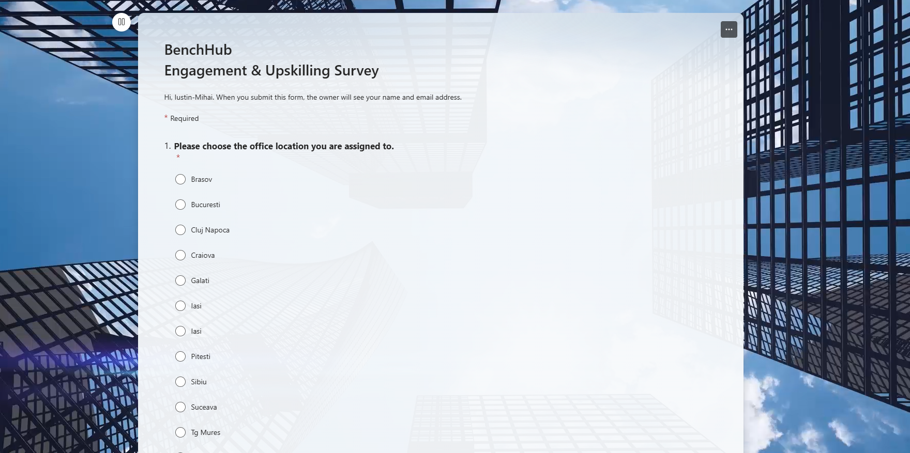
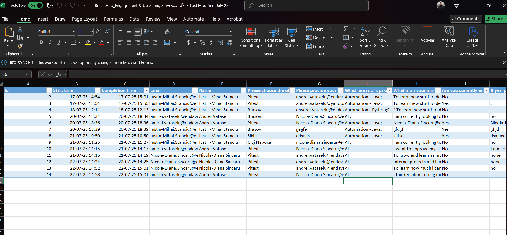
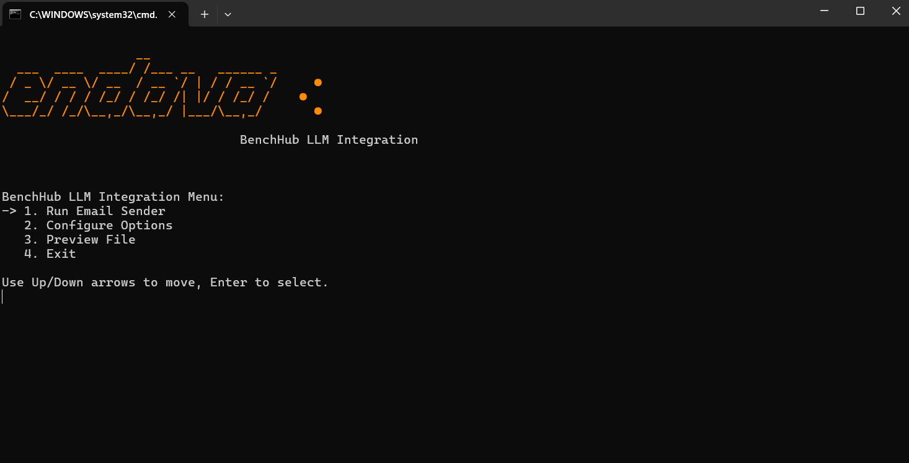
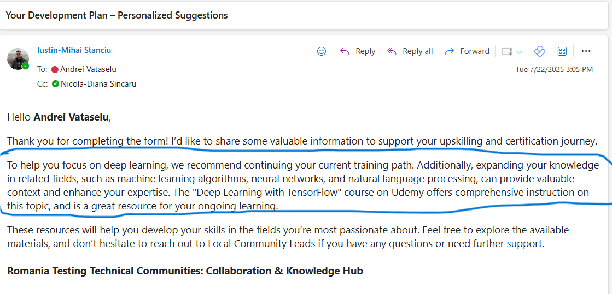
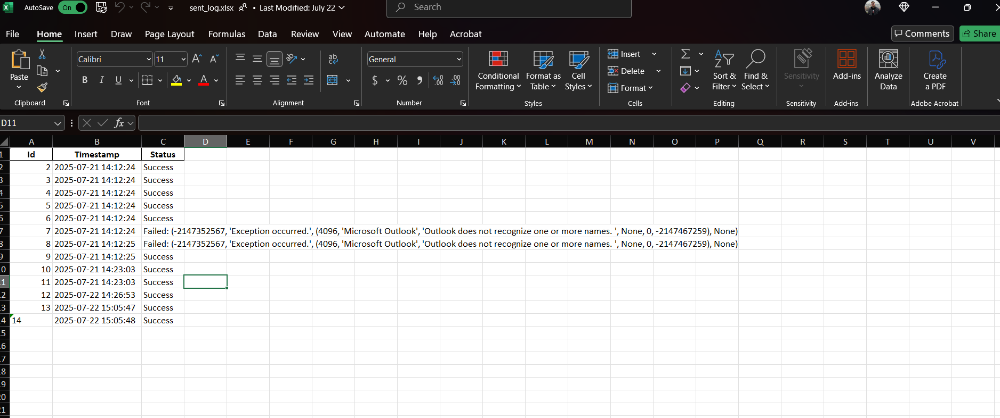

# 🤖 BenchHub LLM Integration

This project automates the generation of personalized development suggestion emails based on Microsoft Forms survey responses. It integrates a local **Mistral LLM**, **OneDrive file sync**, and **Outlook email automation** to create a seamless upskilling workflow.

---

## 🚀 Quickstart Guide

### 1. Clone the Repository

```bash
git clone https://github.com/YouSteen/BenchHub_LLM_integration.git
cd BenchHub_LLM_integration
```

### 2. Run Initial Setup

Navigate to the `scripts/` folder and run:

```bash
scripts/setup.bat
```

This will:

- Install all required dependencies listed in `requirements.txt`
- Create necessary folders and configs

### 3. Start the Application

Run:

```bash
scripts/watch_and_build.bat
```

This will:

- Launch the console-based UI
- Let you choose between email sending, config options, or file preview

> ⚠️ **Email generation won't work out of the box!**
> You must first:

1. Download a quantized version of the **Mistral model** (GGUF format)
2. Install **C++ Build Tools** (required by `llama.cpp` backend)

---

## 🔄 Application Flow – Visual Guide

### 🔹 Step 1 – Microsoft Forms Survey

➡️ 

Employees fill out a Microsoft Form with office location, learning goals, and upskilling preferences.

---

### 🔹 Step 2 – Excel File Synced via OneDrive

➡️ 

Responses are saved in a `.xlsx` file and automatically synced locally via OneDrive. This file is parsed by the application.

---

### 🔹 Step 3 – Console UI Interaction

➡️ 

A terminal-based interface allows:

- Running the email generator
- Configuring OneDrive paths and CC emails
- Previewing survey entries
- Exiting the app

---

### 🔹 Step 4 – LLM-Powered Email Generation

➡️ 

The application:

- Extracts 3 key answers per user
- Passes them into a prompt
- Sends the prompt to the **Mistral LLM**
- Wraps the generated message into a personalized Outlook email

---

### 🔹 Step 5 – Delivery Log Tracking

➡️ 

Each email (sent or failed) is tracked in `sent_log.xlsx` with:

- Timestamp
- Status (Success / Error)
- Details for debugging if needed

---

## 📁 Project Structure

```
BenchHub_LLM_integration/
├── build/               # Build artifacts
├── scripts/             # .bat setup and launch scripts
├── src/                 # Source code
│   ├── llm_core/        # LLM handling and prompt logic
│   ├── menu/            # UI options (send, preview, config, exit)
│   └── utils/           # File handling, Excel parsing, email logic
├── docs/
│   └── flow/            # Screenshots for flow guide
├── requirements.txt     # Python dependencies
├── watch_and_build.py   # Dev environment runner
└── README.md            # You're here :)
```

---

## 🧱 Requirements

- Python 3.10+
- Microsoft Outlook Desktop App
- Installed:
  - `llama-cpp-python`
  - `openpyxl`, `pandas`, `python-dotenv`, etc.

### 🛠 Additional Setup

- ✅ [ ] Download a Mistral model (e.g. [`mistral-7b-instruct.Q4_K_M.gguf`](https://huggingface.co/TheBloke/Mistral-7B-Instruct-v0.2-GGUF))
- ✅ [ ] Install [**C++ Build Tools**](https://visualstudio.microsoft.com/visual-cpp-build-tools/) (required by `llama.cpp` backend)
- ✅ [ ] Setup OneDrive sync on local machine

---

## 📬 Example Use Case

1. Team members complete survey
2. Manager runs the app and sends personalized development suggestions
3. Each interaction is tracked, logged, and automated — no manual follow-up needed

---

## 🙌 Contributors

- **Iustin-Mihai Stanciu** – Author, developer, integrator
- 🧪 Inspired by real-world upskilling flows at **Endava**

---

## 📄 License

MIT License. Free to use, extend, and improve.
